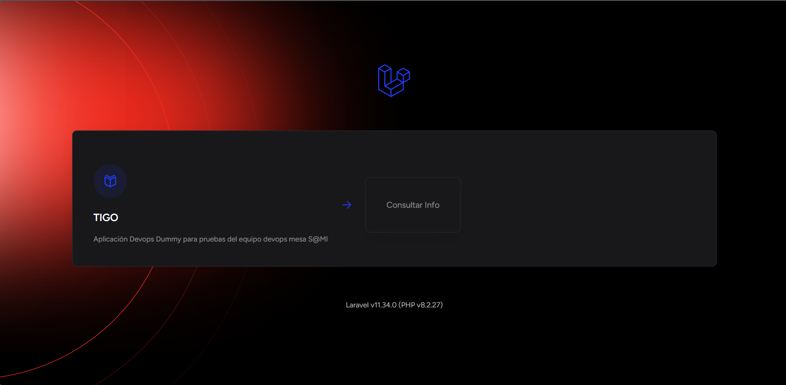

# **DEVOPS DUMMY - HOLALARAVEL**
# **PHP - LARAVEL**

## Descripción del proyecto
Este proyecto dummy consiste en un FrontEnd contenerizado desarrollado en `php` usando el framework `Laravel`, sus pruebas unitarias están siendo desarrolladas utilizando `PHPunit`.

## Funcionamiento
Este proyecto funciona disponiendo de un botón que consultan el backend de Laravel y muestra el texto que devuelve. 




## Objetivo
El objetivo principal de este proyecto es proporcionar un proyecto de prueba para el equipo DevOps. Se utiliza para realizar pruebas de los pipelines de CI/CD desarrollados en el repositorio `devops-pipeline-cicd`. 

Los pasos del pipeline incluyen:

- Compilación de código.
- Ejecución de pruebas unitarias.
- Despliegue de imágenes a Azure Container Registry.
- Despliegue de la aplicación en OpenShift preproductivo y productivo en el namespace `devopsdummy`.

---

## **Implementación en local de la aplicación Dummy**
Para desplegar localmente la aplicación Dummy, se pueden seguir dos métodos: sin Docker o con Docker.

### **Opción 1: Instalación sin Docker**
#### **Tecnologías necesarias**
- Compose
- PHP
- git

#### **Pasos de instalación y ejecución**
1. Clonar el repositorio:
   ```sh
   git clone https://AlcaldiaMedellin@dev.azure.com/AlcaldiaMedellin/DevOps%20Dummy/_git/devopsdummy-laravel-holalaravel-mfe-frontend
   ```
2. Ingresar a la carpeta raíz del proyecto:
   ```sh
   cd devopsdummy-laravel-holalaravel-mfe-frontend
   ```

CONTINUAR...
---

### **Opción 2: Instalación con Docker**
#### **Tecnologías necesarias**
- Docker Desktop
- git

#### **Pasos de instalación y ejecución**
1. Clonar el repositorio:
   ```sh
   git clone https://AlcaldiaMedellin@dev.azure.com/AlcaldiaMedellin/DevOps%20Dummy/_git/devopsdummy-laravel-holalaravel-mfe-frontend
   ```
2. Ingresar a la carpeta raíz del proyecto:
   ```sh
   cd devopsdummy-laravel-holalaravel-mfe-frontend
   ```
4. Construir la imagen Docker:
   ```sh
   docker build -t devopsdummylaravelmfe:1 .
   ```
5. Ejecutar el contenedor:
   ```sh
   docker run -p 8080:8080 devopsdummylaravelmfe:1
   ```
6. Acceder a la aplicación en el navegador: [http://localhost:XXXX](http://localhost:XXXX)

---